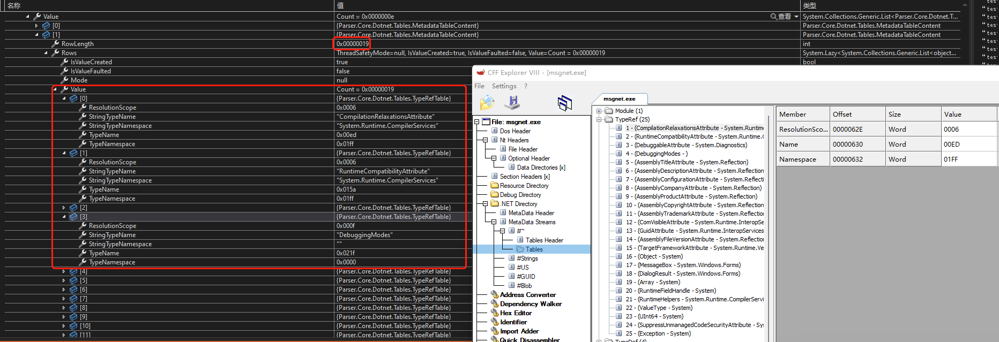

# Parser.Core

> 解析 .NET PE File Format

PE OptionalHeader - CLIHeader as well as IMAGE_COR20_HEADER

IMAGE_COR20_HEADER
	Metadata (MetadataHeader)

MetadataHeader
	StreamHeaders
	#~ Table

> 目前解析到了 StreamHeaders结构 即

* #~
* #Strings
* #US
* #GUID
* Blob

> 接下来解析具体的每一张表

> 解析每张表的Rows

> 解析Module,  TypeRef 表中 Rows的数据

